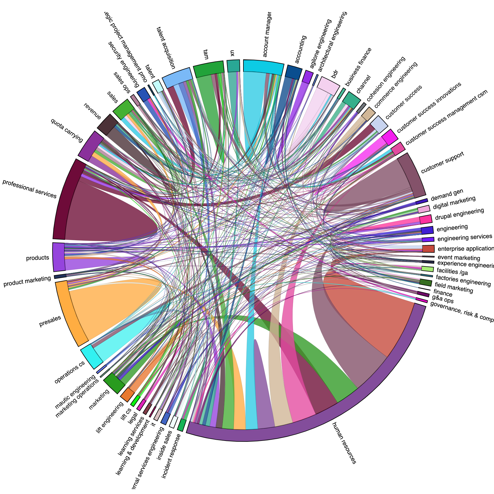

# Bonusly Distribution
Visualizing the Bonusly transaction among teams at my current employer.  
https://balsama.github.io/bonusly-chords/

## Disclaimer
The data gathered by these scripts and presennted in the charts are not 100%
accurate. The scripts make assumptions such as rounding to the nearest day and
making assumptions about teams. Do not treat the data or charts as canonical.

## Re-use
There are a lot of hard-coded assumptions in this repo, but you should be able
use it for your own organization - or at least get started - by renaming
`.bonusly_access_token.example` to `bonusly_access_token`, entering your token,
and running the `compute.php` script.